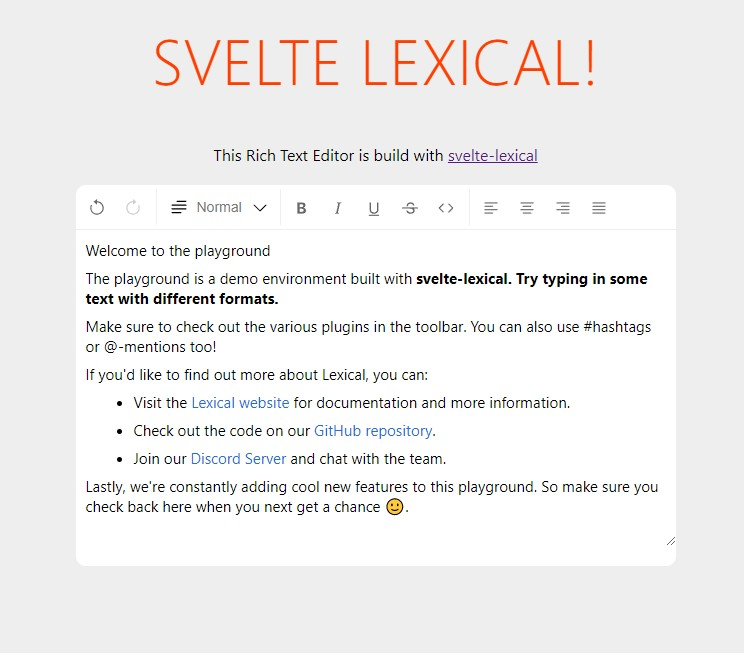

*svelte-lexical is in early development and is not production-ready yet.*

# svelte-lexical

A rich-text editor for Svelte based on [Lexical](https://lexical.dev/)

Lexical is an extensible text editor framework developed by awesome developers at Facebook. The purpose of this project is to provide Svelte bindings for Lexical and also develop high-level components using Lexical.

## Development Notes
- This project is set up as a monorepo using pnpm workspaces.
- To run a demo in development, execute <code>pnpm -C demos/playground dev</code>.
- ESLint is set up for VS Code.
- The npm package is automatically published on creation of a GitHub release using GitHub Actions.
- Unit testing is set up for the svelte-lexical package using Jest and Testing Library.
- E2E testing is set up for the playground package using Playwright.
